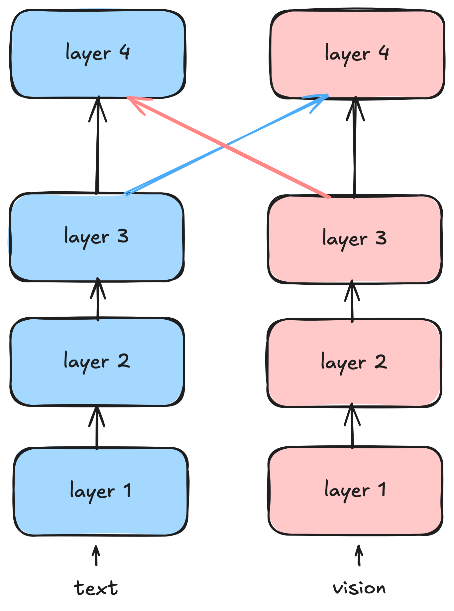

# representational alignment in multimodal transformers

this post covers the work of my bachelor thesis. during the last few months, i did a deep dive into (encoder-)transformers, alignment in multimodal transformers, and representational similarity. here, i show my findings and other interesting stuff i found during my research.

## high-level overview
during my work on the thesis, many people asked me about my thesis topic. when trying to explain it even to other cs students, i struggled, as it is a pretty specialized topic. not even to mention how hard it was to explain it to non-cs people. therefore, i want to give a high-level overview of my thesis topic.

in a nutshell, my research is on the question: *how to bring together vision and language*?
our brain brings together different senses to form the experience we have. for example, when we *eat* an apple, we see the red color, *smell* the distinct apple scent, *taste* the sweet flavor, et cetera.

<figure>

</figure>

for this central question, several approaches were developed. one approach is to use two different encoders (we can think of them as black boxes) that transform each modality (vision, language). after some processing, they are merged together.
in my thesis i analyzed:
<figure>
i) when to merge 
ii) how similar/different are the signals in the process?
</figure>

but let's further build intuition on the problem. why do we really want to fuse text and images together?
**encoders** take an input and transform it to a new representation. this new representation is useful for new tasks. for example, we want to encode the data based on its semantics. ergo, we can retrieve data based on its meaning, not exact matches (like google searches).

it turns out that encoded data in a new representation is more suitable for downstream tasks. for example, when we want to classify articles in a newspaper based on their topic, it is easier to do so in an encoded representation than in the raw text. the encoded representation captures the semantics of the articles better than the raw text.

multiple modalities of the same concept (e.g., image and text of an apple) can provide complementary information. this means that each modality conveys idiosyncratic information that the other modality does not. by fusing them together, the resulting representation includes both modalities. in some cases, the additional information is only available by combining both modalities. an example is memes with ambiguous jokes. here, one modality alone does not suffice to understand the joke. only in combination of image and text does the joke become clear.

in addition, encoding data to vector representations has a couple of advantages:
- encode different lengths of text to fixed lengths
- dot products have a well-defined meaning

## detailed overview

in the research field of representation learning, the fundamental idea is *the manifold hypothesis*. it states that real-world data (e.g., images, text, audio) lies on a low-dimensional manifold embedded in a high-dimensional space. this means that although the data is represented in a high-dimensional space (e.g., pixel values of an image), the actual information content is much lower dimensional.

### encoders
encoding data to vectors is a common approach to generate semantic low-dimensional representations of data. these representations can be used for various downstream tasks, such as classification, retrieval, or generation.

here, data of varied length is encoded to a vector $v \in \mathbb R^n$. the input data $x \in \mathbb R^m, m \gg n$ is a high-dimensional vector with sparse information and high amounts of noise. images of handwritten digits are a prominent example for this. a $64\times64$ array of pixels has 4096 dimensions. however, the actual information content has a dimensionality of one or two.

using a suitable encoder, the data is transformed to the smaller vector, capturing the relevant information.

\[
enc: \mathbb R^m \to \mathbb R^n, \quad m \gg n
\]

in word2vec, the encoder $enc$ is trained by maximizing similarity of words in similar contexts.
here, for similar words $u,v \in \mathbb R^n$, the probability

\[
    u\cdot v = u^T v \\
    p(u|v) = \frac{\exp(u\cdot v)}{\sum_{w\in V} \exp(w\cdot v)}
\]
is maximized. using $\exp(\cdot)$ ensures that the dot product is positive and amplifies differences. the denominator is a normalization factor over all the words, ensuring that the probabilities sum to one.

newer architectures like BERT use the attention mechanism in transformers to encode text.
using two pretraining techniques, the transformer implicitly learns to encode text to semantically meaningful vectors.
basically, the transformer learns to transform representations to a more suitable form for downstream tasks.
in a transformer like BERT, multiple layers exist. in BERT base, there are 12 layers. every layer transforms the representation to a new representation.

### early vs. late fusion

in the ViLBERT architecture (by Lu et al., 2019), the idea is similar to the brain. separate pretrained encoder models process each modality before integrating them into one representation.

individual processing extracts relevant features from raw data. by using pretrained models, the model can leverage knowledge learned from large datasets. this is especially useful when the multimodal dataset is small.

for the text modality, a BERT model is used, while vision utilizes a vision transformer (ViT).
both BERT and ViT consist of 12 transformer layers. in order to fuse the modalities, a bidirectional cross-attention layer is placed between the 12 layers. this acts as a coordination mechanism on the representations of both modalities.

<figure>

</figure>

the above figure shows the two streams. up to layer three, the modalities extract features independently. only in layer 4 are both modalities fused together. while independent feature extraction is performed using *self-attention*, the fusion is done using *cross-attention*.

below, the cross-attention block introduced in ViLBERT is shown in detail.

<figure>

</figure>

basically, the visual stream attends to the linguistic stream by swapping keys and values ($K_{modality}, V_{modality}$). the formula for vision therefore is:

\[
    \operatorname{Softmax}(\frac {Q_V^TK_W} {\sqrt d} )V_W
\]

to build intuition: the vision stream has its queries $Q_V$. these queries are used to find useful information in the keys of the text stream $K_W$. this corresponds to the weighted values of the text stream that are important.
as in standard attention, the factor $d$ is used to prevent large dot products. it's not relevant here.

the strength of this approach is its modularity. ViLBERT's dual-stream architecture allows different fusion methods like early, middle, and late fusion.

in modality theory, modalities are on a spectrum with the extremes of *raw* and *abstract*. input data is raw, while encoded/processed data is abstract. early fusion fuses raw data, while late fusion fuses abstract data. middle fusion is in between.
the question is: when to fuse the modalities? some tasks might need raw modalities (e.g., image captioning), while others might benefit from abstract modalities (e.g., visual question answering).
i evaluated these configurations on three datasets (hateful memes, mm-imdb, upmc food-101).
the three tasks:
- mm-imdb: predict genre based on movie description and poster; relatively easy task, text dominant
- upmc food-101: predict food type based on image and recipe; medium difficulty, image dominant
- hateful memes: predict if a meme is hateful; hard task, needs both modalities and complex reasoning abilities

## late fusion wins
in my thesis i compared different cross-attention placements on three different tasks.
the table shows a selection of configurations and their results:

| configuration | placement (layers) | hateful memes (auroc) | mm-imdb (f1) | upmc food (acc) |
| :--- | :--- | :--- | :--- | :--- |
| baseline 1 (no fusion) | [ ] | 0.654 | 0.483 | 0.887 |
| baseline 2 (full fusion) | [1 - 12] | 0.707 | 0.528 | 0.909 |
| early fusion | [4, 5, 6] | 0.723 | 0.512 | 0.893 |
| middle fusion | [7, 8, 9] | 0.750 | 0.533 | 0.918 |
| **late fusion** | **[10, 11, 12]** | **0.764** | **0.545** | **0.928** |

there was a clear winner: in each of the diverse tasks i evaluated, late fusion performed best. even "full fusion" (interacting at every single layer) performed significantly worse than late fusion, proving that more interaction isn't always better.

### why does this happen?

i decided to further investigate *why* late fusion outperformed early fusion.
here i utilized representational alignment metrics (CKA, orthogonal procrustes, SVCCA) and dimensionality reduction to further explain the inner workings of the transformers.

the first analysis compared representational similarity after each layer, i.e., representations are compared before vs. after each layer.
mathematically, for every layer $i$, the representations are denoted as $R^i_{modality}$. in the following graph, the representational similarity is computed for each layer transition:

\[
\operatorname{cka}(R^i_{modality}, R^{i+1}_{modality}), \forall i \in [0, \dots, 10]
\]

<figure>

<figcaption>representational similarity (CKA) of layer transitions, gray indicates cross-attention placement, n=3 seeds </figcaption>
</figure>

this plot reveals something interesting. when you look at the gray bars (where cross-attention happens), the similarity drops significantly. this means cross-attention fundamentally restructures the representation space. it doesn't just "add" information; it changes the geometry of the space entirely. this makes sense, as the transformer learns to create a new, fused representation with new features.

to further examine the mechanics of fusion, i analyzed the effective dimensionality of the representations. to do this, for each $R^i_{modality}$, i computed the dimensionality-reduced representation that accounts for 95% of variance.
the assumption is as follows: if a representation has high effective dimensionality, the transformer learned more complex and rich features.

<figure>

<figcaption>layerwise effective dimensionality of representations, gray indicates cross-attention placement, n=3 seeds </figcaption>
</figure>

when you look at the purple line (vision) in early fusion versus late fusion, you see two main insights:

<figure>
i) text is robust: the text stream (yellow) maintains high dimensionality (~250-300 dimensions) regardless of when fusion happens. it is stable.  
ii) vision is fragile: when we force early fusion, the vision stream undergoes a catastrophic dimensionality collapse.
</figure>

in all experiments, cross-attention after self-attention decreases effective dimensionality of the vision stream. self-attention learns complex features that are combined into rather simple features in cross-attention.
in my thesis, i hypothesized that BERT features are more robust than ViT features due to their different pretraining objectives and patch-based representation.